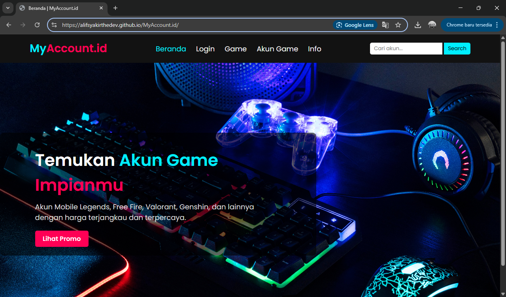

<h1 align="center">🎮 Website Jual Beli Akun Game</h1>

  

## 🙏 Sambutan dan Ucapan Terima Kasih

Dengan penuh hormat, saya mengucapkan terima kasih kepada **Pak Reza Syafrizal, M.Kom.** pada mata kuliah **Pengenalan Pemrograman** yang telah membimbing dan memberikan ilmu selama satu semester ini.  
Website ini dibuat sebagai bagian dari tugas Ujian Akhir Semester (UAS) pada mata kuliah Pengenalan Pemrograman. Proyek ini bertujuan untuk mengaplikasikan materi yang telah dipelajari, seperti penggunaan struktur dasar HTML, pemanfaatan CSS untuk tampilan antarmuka, serta proses hosting menggunakan GitHub Pages. Harapannya, tugas ini dapat mencerminkan pemahaman saya terhadap konsep dasar pemrograman web yang telah diajarkan selama satu semester penuh.  
---

## 📌 Deskripsi Singkat
Website ini dibuat menggunakan **HTML dan CSS**, dengan tampilan responsif dan fitur navigasi antar halaman yang memudahkan pengguna. Terdapat halaman beranda, daftar akun game, halaman detail, serta sistem pembayaran yang dapat dipilih sesuai jenis game.

## 🧩 Struktur Halaman

- `index.html` – Halaman utama/beranda.
- `game.html` – Menampilkan daftar akun game.
- `akun.html` – Detail akun game pilihan.
- `pembayaran.html` – Form pembayaran dengan opsi game.
- `info.html` – Halaman informasi & promo.
- `login.html` – Halaman login.

## 🎨 Teknologi yang Digunakan

- HTML5
- CSS3
- Git & GitHub Pages

## 🚀 Cara Menjalankan

1. Buka link GitHub Pages:  
   👉 [Lihat Website MyAcccount.id](https://alifsyakirthedev.github.io/MyAccount.id/)  

2. Navigasi menu tersedia di bagian atas halaman.

## 📁 Struktur Folder
    docs/
    ├── index.html
    ├── game.html
    ├── akun.html
    ├── pembayaran.html
    ├── info.html
    ├── login.html
    ├── *.css
    ├── *.jpg / *.png

## 🧑‍🎓 Informasi Mahasiswa

- **Nama:** Muhamad Alif Farras Syakir
- **NIM:** 241730009 
- **Mata Kuliah:** Pengenalan Pemrograman  
- **Dosen Pengampu:** Reza Syafrizal, M.Kom. 
- **Semester:** II

## ✅ Tujuan Proyek

- Menerapkan struktur HTML yang baik dan semantic.
- Mendesain layout halaman menggunakan CSS.
- Memahami proses deployment melalui GitHub Pages.
- Membuat alur navigasi antar halaman dalam sebuah website statis.

## 📬 Kontak

Untuk pertanyaan atau masukan:  
📧 Email: [alifsyakir022@gmail.com]  
📍 GitHub: [github.com/AlifSyakirtheDev]

---

**© 2025 – Website Jual Beli Akun Game | Untuk keperluan tugas akademik**
